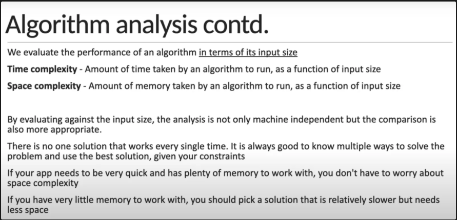
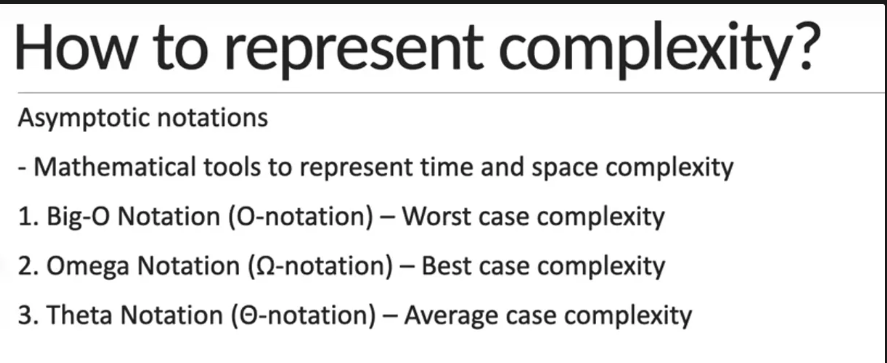
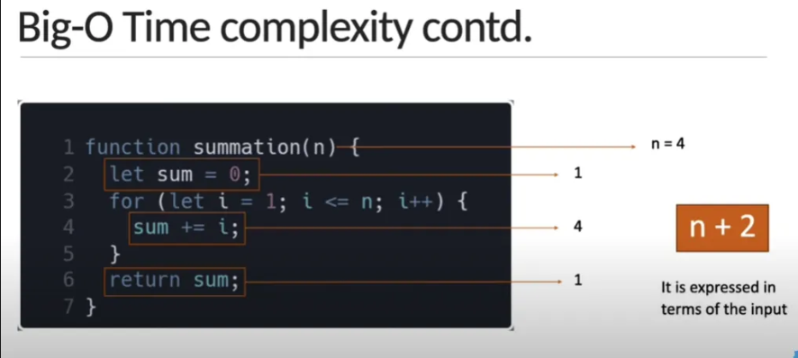
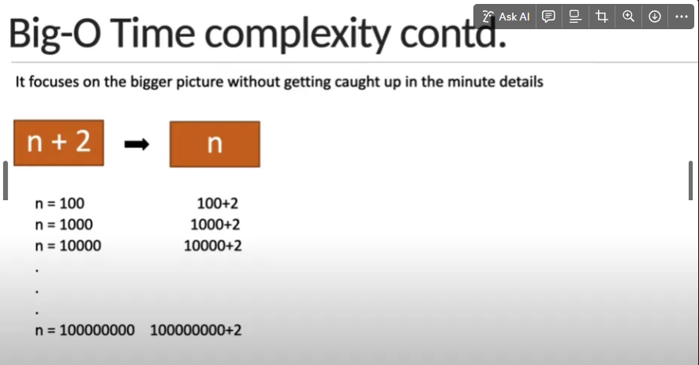
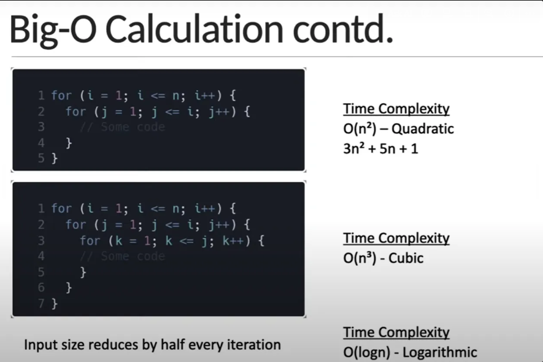
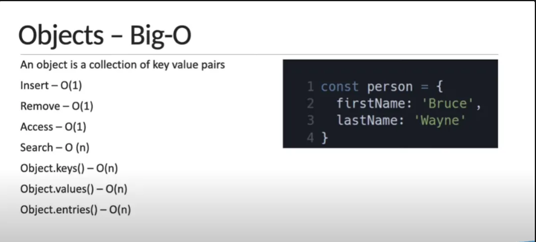
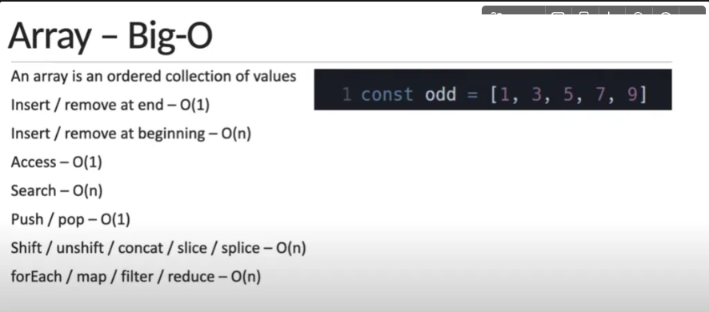
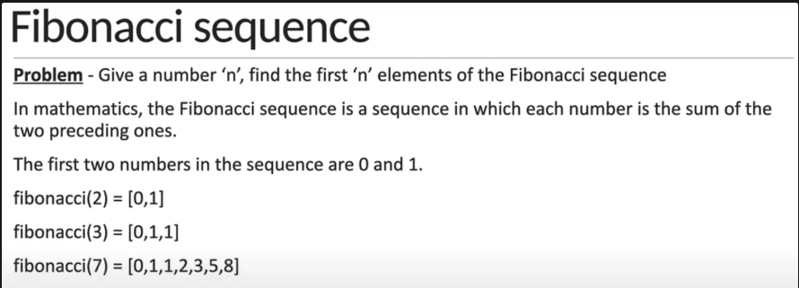
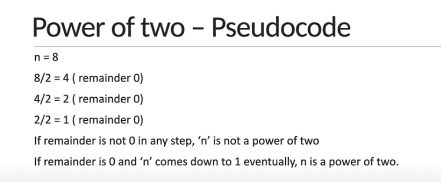

# 🧠 What is an Algorithm?

An algorithm is a step-by-step set of instructions designed to perform a specific task or solve a particular problem.

| Notation   | Name         | Meaning                        | Example                        |
| ---------- | ------------ | ------------------------------ | ------------------------------ |
| O(1)       | Constant     | Always takes the same time     | Accessing an array element     |
| O(log n)   | Logarithmic  | Divides the input repeatedly   | Binary Search                  |
| O(n)       | Linear       | Grows directly with input size | Looping through an array       |
| O(n log n) | Linearithmic | Often seen in efficient sorts  | Merge Sort, Quick Sort         |
| O(n²)      | Quadratic    | Nested loops                   | Bubble Sort                    |
| O(2ⁿ)      | Exponential  | Doubles every time             | Recursive Fibonacci            |
| O(n!)      | Factorial    | All permutations               | Brute-force Traveling Salesman |
















# Basics Problems

## Fibonacci Sequence



```javascript
//Big-O = O(n)
function FibonacciSequence(n) {   
    let arr = [0, 1]
    if (n < 2) return arr[n]
    if (n < 0) return console.log("No value for this")

    for (i = 2; i < n; i++) {
        arr[i] = arr[i - 1] + arr[i - 2]
    }
    return arr
}
// console.log(FibonacciSequence(2))
// console.log(FibonacciSequence(0))
// console.log(FibonacciSequence(10))
// console.log(FibonacciSequence(-5))
// console.log(FibonacciSequence(4.5))
```
## Factorial of a Number
```javascript
//Big-O = O(n)
function Factorial(n) {
    let result = 1
    for (i = 2; i <= n; i++) {
        result *= i
        console.log(`${i} * ${result / i} = ${result}`)
    }
    return result
}

console.log(Factorial(0))
console.log(Factorial(1))
console.log(Factorial(4))
```

## Prime Number

```javascript
//Big-O = O(sqrt(n))
function PrimeNumber(n) {
    if (n < 2 ) return 'not prime';
    if (n == 2) return 'prime';
    if (n % 2 === 0) return 'not prime';

    for(i=3; i<=Math.sqrt(n); i += 2) {
        if(n % i == 0) return 'notPrime'
    }
    return 'prime'
}

console.log(PrimeNumber(0))
console.log(PrimeNumber(1))
console.log(PrimeNumber(4))
console.log(PrimeNumber(13))
```

## Power of Two

```javascript
//Big-o = O(log(n))
function PowerofTwo(n) {
    if(n < 1) return "Not power of 2'"
    while(n > 1) {
        if(n % 2 != 0) return 'Not power of 2';
        n /= 2
    }
    return "Power of 2"
}

console.log(PowerofTwo(2))
console.log(PowerofTwo(5))
console.log(PowerofTwo(16))
console.log(PowerofTwo(20))
console.log(PowerofTwo(0))

//Big-O = 0(1)
function isPowerofTwoBitwise(n) {
if (n < 1) return false;
return (n & (n-1)) === 0;
}

console.log(isPowerofTwoBitwise(16))
```


